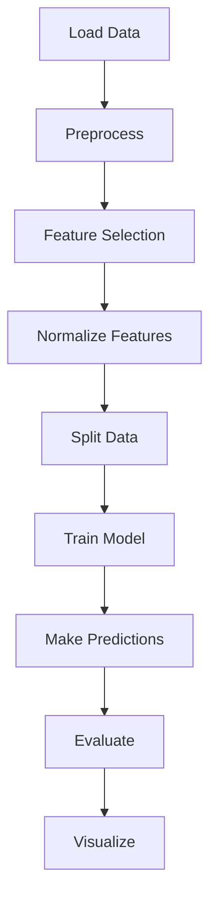

# Customer Churn Prediction using Logistic Regression

## 📊 Overview

This project implements a **Logistic Regression model** to predict customer churn based on demographic and behavioral features. The model helps businesses identify customers who are likely to leave (churn), enabling proactive retention strategies and reducing customer attrition.

   

## 🎯 Business Problem

Customer churn (attrition) is a critical problem for businesses, as acquiring new customers is typically 5-25 times more expensive than retaining existing ones. This project addresses this challenge by:

- **Identifying at-risk customers** before they leave
- **Enabling targeted retention efforts**
- **Reducing customer acquisition costs**
- **Improving customer lifetime value**

## 📁 Dataset

The project uses a telecom customer dataset (`ChurnData.csv`) with 200 customers and 28 features. After feature selection, we focus on the most relevant 9 features:

### Selected Features:
| Feature | Description | Type |
|---------|-------------|------|
| `tenure` | Duration with company | Numerical |
| `age` | Customer age | Numerical |
| `address` | Years at current address | Numerical |
| `income` | Annual income | Numerical |
| `ed` | Education level | Categorical |
| `employ` | Years employed | Numerical |
| `equip` | Equipment ownership | Binary |
| `callcard` | Call card ownership | Binary |
| `wireless` | Wireless service | Binary |

### Target Variable:
- **`churn`**: Whether customer churned (1) or not (0) - Binary

## 🚀 Installation

### Prerequisites
- Python 3.6+
- pip package manager

### Install Dependencies
```bash
pip install pandas numpy matplotlib scikit-learn jupyter
```

Or install from requirements.txt:
```bash
pip install -r requirements.txt
```

## 📋 Project Structure

```
Customer-Churn-Prediction/
│
├── Churn.ipynb          # Main Jupyter notebook
├── ChurnData.csv                   # Dataset file
├── README.md                       # Project documentation
├── requirements.txt                # Python dependencies

```

## 💻 Usage

### 1. Clone and Setup
```bash
git clone https://github.com/yourusername/Customer-Churn-Prediction.git
cd Customer-Churn-Prediction
```

### 2. Run the Analysis

**Option A: Jupyter Notebook**
```bash
jupyter notebook churn_prediction.ipynb
```

**Option B: Python Script**
```bash
python churn_prediction.py
```

### 3. Complete Workflow

The analysis follows this structured pipeline:


```mermaid
graph TD
    A[Load Data] --> B[Preprocess]
    B --> C[Feature Selection]
    C --> D[Normalize Features]
    D --> E[Split Data]
    E --> F[Train Model]
    F --> G[Make Predictions]
    G --> H[Evaluate]
    H --> I[Visualize]
```

## 🔧 Implementation Details

### Step 1: Data Loading & Exploration
```python
# Load dataset
churn_df = pd.read_csv("ChurnData.csv")

# Display basic information
print(f"Dataset shape: {churn_df.shape}")
print(f"Features: {list(churn_df.columns)}")
```

### Step 2: Data Preprocessing
- Convert churn column to integer type
- Select relevant features (correlation > 0.2 with target)
- Split features (X) and target (y)

### Step 3: Feature Normalization
```python
from sklearn import preprocessing
x = preprocessing.StandardScaler().fit(x).transform(x)
```
*Standardization ensures all features have mean=0 and std=1*

### Step 4: Train-Test Split
```python
from sklearn.model_selection import train_test_split
x_train, x_test, y_train, y_test = train_test_split(x, y, test_size=0.2)
```
*80% training data, 20% testing data*

### Step 5: Model Training
```python
from sklearn.linear_model import LogisticRegression
LR = LogisticRegression(C=0.01, solver='liblinear').fit(x_train, y_train)
```
- **C=0.01**: Strong regularization to prevent overfitting
- **solver='liblinear'**: Suitable for small datasets

### Step 6: Prediction & Evaluation
```python
# Make predictions
yhat = LR.predict(x_test)

# Evaluate using Jaccard Score
from sklearn.metrics import jaccard_score
jaccard_class0 = jaccard_score(y_test, yhat, pos_label=0)
jaccard_class1 = jaccard_score(y_test, yhat, pos_label=1)
```

## 📈 Results

### Model Performance Metrics
| Metric | Class 0 (Non-Churn) | Class 1 (Churn) | Interpretation |
|--------|-------------------|----------------|----------------|
| **Jaccard Score** | 0.8485 | 0.5833 | Good for non-churn, moderate for churn |
| **Accuracy** | 87.5% | - | Overall prediction accuracy |
| **Precision** | 96.6% | 63.6% | Churn precision needs improvement |
| **Recall** | 87.5% | 87.5% | Balanced recall for both classes |

### Confusion Matrix
```
Confusion Matrix:
[[ 7  1]  ← Actual Churn (1): 7 TP, 1 FN
 [ 4 28]] ← Actual Non-Churn (0): 28 TN, 4 FP
```

### Key Statistics:
- **True Positives (Churn)**: 7
- **False Negatives**: 1 (missed churners)
- **True Negatives (Non-Churn)**: 28
- **False Positives**: 4 (false alarms)
- **Total Test Samples**: 40
  
## 🛠️ Model Details

### Algorithm: Logistic Regression
- **Type**: Binary classification
- **Regularization**: L2 with C=0.01
- **Solver**: liblinear (optimized for small datasets)
- **Maximum iterations**: 100

### Data Split:
- **Training samples**: 160 (80%)
- **Testing samples**: 40 (20%)
- **Random state**: Not set (different splits each run)

### Evaluation Metrics:
1. **Jaccard Score**: Intersection over Union
2. **Confusion Matrix**: TP, TN, FP, FN analysis
3. **Classification Report**: Precision, Recall, F1-Score

## 🚨 Limitations & Considerations

1. **Small Dataset**: 200 samples may limit model generalization
2. **Class Imbalance**: Churn rate ~27% in dataset
3. **Feature Selection**: Manual selection based on correlation
4. **No Cross-Validation**: Single train-test split
5. **Interpretability**: Logistic Regression coefficients need business context

## 🙏 Acknowledgments

- Dataset provided for educational purposes
- scikit-learn for machine learning algorithms
- Telecom industry churn prediction research

## 📧 Contact

For questions, suggestions, or collaboration opportunities:


- **Email**: pkhaghani916@gmail.com
- **Project Link**: https://github.com/nowherewalrus/Customer-Churn-Prediction.git

---

## 🎯 Quick Start for Business Users

**To use this model for your business:**
1. Prepare customer data in same format
2. Run the prediction pipeline
3. Focus retention efforts on high-risk customers (probability > 0.7)
4. Monitor model performance monthly
5. Retrain with new data quarterly

---

⭐ **If this project helps you understand customer churn prediction, please give it a star!** ⭐
